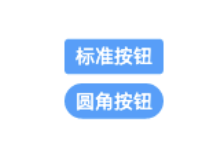
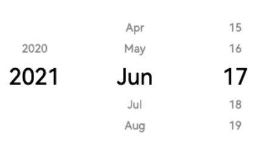

### 项目介绍
对 HarmonyOS 应用 Java UI 框架进行封装，使其可以作为一套符合 Element UI 风格的组件，在各种项目中使用。


#### 项目特点


#### 目录结构

- component ：UI 组件，对 HarmonyOS 应用 Java UI 组件的封装，可以在项目中作为标准的 Element UI 风格组件使用
- config ：UI 组件配置参数
- example ：UI 组件使用实例
- layout ：布局容器，对 HarmonyOS 应用 Java UI 布局容器的封装
- template ：HarmonyOS 布局模板


### 使用效果展示

#### 首页


#### Text

```java
        Text text = TextFactory.getText(getContext(),"HelloWorld");
```


#### Button

```java
        Button button = ButtonFactory.getButton(getContext(),"标准按钮");
        Button roundButton = ButtonFactory.getRoundButton(getContext(),"圆角按钮");
```



#### DatePicker

```java
				String minDate = "2020-01-01";
        String maxDate = "2021-12-31";
        DatePicker datePicker = DatePickerFactory.getDatePicker(getContext(),minDate,maxDate);
```



#### Image

```java
Image image = ImageFactory.getImageByResourceId(getContext(), ResourceTable.Media_java);
```


#### RoundProgressBar

```java
RoundProgressBar roundProgressBar =
                ProgressBarFactory.getRoundProgressBar(getContext(),40,200);
```


### 版本说明

#### 已完成

- V1.0 
  - 发布时间：2021-06-11 20:09:12 
   - 版本内容：
     - 实现 Java UI 组件的简易封装
     - 对 AbilitySlice 进行封装，构造出 Slice 模板 TemplateSlice，实现了 Slice 的快速开发

#### 开发中

- V2.0
  - 发布时间 ：待定
  - 版本内容：
    - 实现 Java UI 组件的 Element UI 风格化

#### 规划中

- v3.0
  - 发布时间：待定
  - 版本内容：
    - 添加常用模板页面
- v4.0
  - 发布时间：待定
  - 版本内容：
    - 添加常用自定义组件