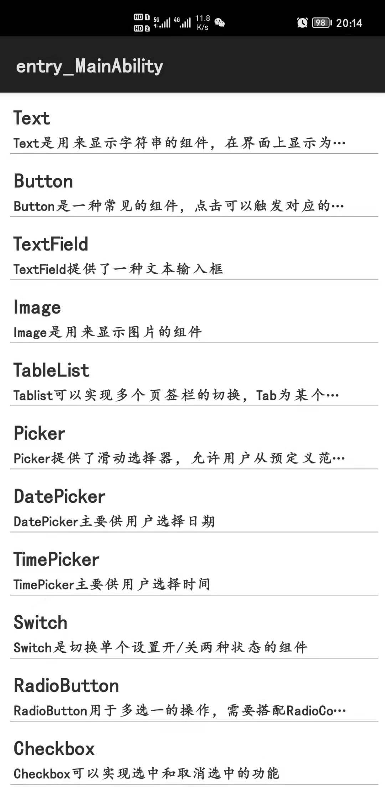

### 项目说明
对 HarmonyOS 应用 Java UI 框架进行封装，使其可以作为一套符合 Element UI 风格的组件，在各种项目中使用。

### 版本说明
- V0.1 
 - 发布时间：2021-06-11 20:09:12 
 - 版本内容：
  - 实现 Java UI 组件的简易封装
  - 对 AbilitySlice 进行封装，构造出 Slice 模板 TemplateSlice，实现了 Slice 的快速开发

### 目录结构
- component ：UI 组件，对 HarmonyOS 应用 Java UI 组件的封装，可以在项目中作为标准的 Element UI 风格组件使用
- config ：UI 组件配置参数
- example ：UI 组件使用实例
- layout ：布局容器，对 HarmonyOS 应用 Java UI 布局容器的封装
- template ：HarmonyOS 布局模板

### 界面效果

